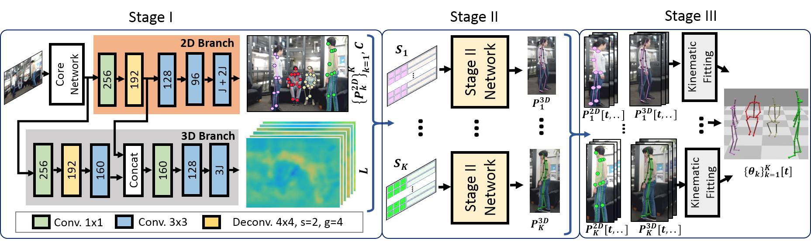

# 姿态检测公式

- 已知图像I维度是w*h, 3D姿态为$\{P^{3D}_k\}^K_{k=1}$,其中K是图片中人体数目，$P_k^{3D}\in\mathbb{R}^{3\times J}$表示J个身体节点坐标，坐标是相对于盆骨节点（根节点）的。
- Stage I 预测：
  

核心网络+两个分支网络，一个分支预测2D姿态坐标，另一支预测3D姿态编码，核心网络输出图像尺度为$\frac{w}{16}\times\frac{h}{16}$，两个分支网络输出图像尺度为$\frac{w}{8}\times\frac{h}{8}$，且3D分支要引入2D分支中的部分特征
    

    
    - core network: selecsls net
SelecSLS模型在选择方式上使用短长范围跳跃连接,在模块内部用短范围跳跃连接，在各模块间使用长范围跳跃连接。中间特征数用k表示，最终输出特征数用$n_0$表示，卷积跨步用s表示。长连接中每个后续模块都和第一个模块连接这是为了提升网络中的信息流
        

        
一个等级定义为一连串模块它们会输出相同的空间分辨率的特征图
        
    - 2D分支：
      
              预测2D热点图$H=\{H_j\in\mathbb{R}^{\frac{w}{8}\times\frac{h}{8}}\}_{j=1}^J$,其中J代表所有关节数,此分支使用了Part Affinity Fields(PAF)网络$F=\{F_j\in\mathbb{R}^{\frac{w}{8}\times\frac{h}{8}\times2}\}_{j=1}^J$,它表示给身体关节所有者编码，编码使用了一个单位矢量场表示关节点到运动母体的方向且矢量场宽度为相应肢体的宽度，目的是检测图片中出现的个体以及可见的关节其次是关联可见的关节到个体上。该分支输出2D身体节点位置以图像绝对坐标定位$P^{2D}_k\in\mathbb{Z}_+^{2\times J}$, 共有K个个体每个个体有J个关节，该分支还输出检测置信度$c_{j,k}$,它来自于热点图的最值。
        
    - 3D分支：
      
             预测中间3D姿态编码图 $L=\{L_j\in\mathbb{R}^{\frac{w}{8}\times\frac{h}{8}\times 3}\}_{j=1}^J$，该分支利用了核心网络的输出特征和2D分支网络的部分特征。在每一可见关节上的空间位置处的编码涵盖了它的3D位姿，此位姿是相对于在运动链上直接和此节点相连的其他节点的。从3D输出图L的$(u,v)_{j,k}$位置处提取向量$\vec{l}_{j,k}$矢量形状$1\times1\times3J$,它包含的是身体全部节点的3D姿态，每个节点的相对于母体（根节点）的坐标位于不同的通道
        
        
        
        $\vec{l}_{j,k}$只编码和本节点j在骨架上直接相连的节点，形式顺序是父节点-本节点和本节点-子节点，没有本节点-父节点形式顺序，且标记的坐标都是相对于父节点的，这样不用把所有节点都标记。
        
    - 输出到Stage II的特征：
      
              每一个个体k的可见关节的2D关节坐标 $P_k^{2D}$,关节置信度$\{c_{j,k}\}^J_{j=1}$,关节3D坐标编码$\{l_{j,k}\}^J_{j=1}$
        
    - Stage I分阶段训练，core network和2D分支在单人数据集中训练，然后再在多人数据集中训练；

- Stage II预测：
    - 全连接网络对每一个人的每一个可见节点预测相对于根节点的3D坐标$\{P_k^{3D}\}^K_{k=1}$
    - 先把$P_k^{2D}$坐标转成相对于脖子节点的坐标
    - 连接关节相对脖子的坐标$(u,v)_{j,k}$，关节检测置信度 $c_{j,k}$和关节3D坐标编码$l_{j,k}$为$S_k\in\mathbb{R}^{J\times(3+3\cdot J)}$,如果关节不可见就只连接成0矢量
    
    
    
    - Stage II是一个5层的全连接网络，它将$S_k$转成相对于根节点的3D坐标$P_k^{3D}$
      
        
        
    - Stage II 训练：
      
             Stage II 网络在MuCo-3DHP非截取的帧中训练,首先用Stage I网络在这个数据集里运行得到2D坐标和3D坐标编码，然后对每一个个体使用真实的相对于根节点的3D坐标$\{(X_j,Y_j,Z_j)\}^J_{j=1}$作为标签来训练Stage II, 使用smooth-L1 loss减轻遮挡产生的预测和标签的差异性
    
- Stage III:
  
    经过Stage I和Stage II得到了一个帧中一个人的相对于根节点的3D坐标，但是没有估计人的大小和距离相机的距离，同一人的身份没有在所有帧中进行追踪
    
    - 为了在不同帧中追踪识别同一个人坐标
      
               现将先前的变量加一个时间索引例如$\{P_i[t]\}^{K[t]}_{i=1}$, 我们建模和持续追踪人的样子通过半身区域的HSV颜色直方图，对每个人切割颜色和饱和度通道成30份，在包含人体关节的边界框中定义类别概率为人体模样$A_{i}[t]$，缺点是颜色相似的个体问题。为了在不同帧中匹配对象更有鲁棒性匹配当前探测的人体i上先前已知的人体k要利用3个相似性，分别是人体模样相似性$S_{i,k}^A=(A_i[t]-A_k[t-1])^2$，2D坐标相似性$S_{i,k}^{P^{2D}}=(P^{2D}_i[t]-P^{2D}_k[t-1])^2$和3D坐标相似性$S_{i,k}^{P^{3D}}=(P^{3D}_{i}[t]-P^{3D}_{k}[t-1])$,通过设置相似性阈值检测人体被遮挡、人离开图片、人进入图片。
        
    - 相对骨头长和绝对高度
      
                骨头长是一个尺度不变量，可以用$P_k^{3D}$计算，为了增加鲁棒性对连接节点的骨头长度$b_k$在10帧中做正态归一化处理。
                
                 将相对根节点2D坐标转成3D绝对坐标以cm为单位，这一任务很难只能凭借单目镜头猜测。先决定人在相机中的相对坐标，人的高度是从地面到一个交叉点的距离，该交叉点是放在足部位置处的虚拟广告牌和通过头部位置的视线的交点。
    
    
    - Kinematic Skeleton Fitting
      
                 得到2D和3D坐标，优化骨骼坐标$\{\theta_k[t]\}^{K[t]}_{k=1}$, $K[t]$是场景中t时刻所有的人数，$\theta_k[t]\in\mathbb{R}^D$从固定骨架的关节角度加上全局根节点坐标描述人的姿态坐标, ，D=29是一个骨骼的自由度数。估计$\theta_k[t]$使拟合能量最小化：
        
        $$
        \varepsilon(\theta_1[t],...,\theta_K[t])=w_{3D}E_{3D}+w_{2D}E_{2D}+w_{lim}E_{lim}+w_{temp}E_{temp}+w_{depth}E_{depth}
        $$
        
        权重$w_{3D}=9e-1, w_{2D}=1e-5, w_{3D}=5e-1, w_{temp}=1e-7, w_{depth}=8e-6$；
        
        3D逆运动误差：
        
        误差：预测的相对根节点的3D坐标$P^{3D}_k[t]$和骨骼$\mathscr{P}(\theta_k[t],b_k)$坐标，它由每个人k的每个关节j和骨骼长度$b_k$正向运动构成
        
        $$
        E_{3D}=\sum_{k=1}^K\sum_{j=1}^{J^{3D}}||\mathscr{P}(\theta_k[t],b_k)_j-P^{3D}_{k,j}[t]||_2^2
        $$
        
        2D从投影误差：
        
        误差：预测的2D关节坐标$P^{2D}_k[t]$和骨骼投影 $\mathcal{P}(\theta_k[t],b_k)_j$坐标
        
        $$
        E_{2D}=\sum_{k=1}^K\sum_{j=1}^{J^{2D}}w_j^{2D}c_{j,k}||\Pi(h_k\mathcal{P}(\theta_k[t],b_k))_j-P^{2D}_{k,j}[t]||_2^2
        $$
        
        这里$c$是2D预测的置信度，$w_j^{2D}$是每个节点的相对权重, 下肢关节权重相对于躯干关节（屁股、脖子、肩膀）是1.7，同理肘是1.5，手腕是2.0，$\Pi$是相机投影矩阵，注意$\mathcal{P}(\theta_k[t],b_k))_j$输出单位高度，缩放因子$h_k$把它影射到测量坐标
        
        关节角度限制误差：
        
          误差：关节限制规范给关节旋转角度范围增加限制，这是基于解剖学的关节角度范围
        
        $$
        E_{lim}=\sum_{k=1}^K\sum_{j=7}^{D=29}\left\{\begin{aligned}&(\theta_j^{min}-\theta_{k,j}[t])^2 & &,if \quad\theta_{k,j}[t]<\theta_j^{min}\\ &(\theta_{k,j}[t]-\theta_j^{max})^2  & &,if\quad \theta_{k,j}[t]>\theta_j^{max}\\ &0 & &,otherwise\end{aligned}\right.
        $$
        
        骨架自由度从7开始是因为对全局位置和旋转参数没有限制，神经网络的估计的关节位置对于关节角度没有限制
        
        时间平滑误差：
        
        误差：网络基于每帧估计的坐标会存在时间上的抖动
        
        $$
        E_{temp}(\Theta)=\sum_{k=1}^K||\nabla\theta_k[t-1]-\nabla\theta_k[t]||^2_2
        $$
        
           使用平滑项更多惩罚深度方向有更少约束的变量，$E_{depth}=||\theta_{k,2}[t]_z-\theta_{k,2}[t-1]_z||$,这里$\theta_{k,2}$是自由度，它驱动了根节点的z坐标
        
        逆运动追踪初始化：
        
           对于新人追踪时的头一帧，局部关节角度拟合3D预测坐标且只考虑 $E_{3D}$和$E_{lim}$误差，之后这些关节角度锁死同时最小化$E_{2D}$,这是为了对骨骼的全局位移和旋转做最佳拟合，随后完整的能量公式$\varepsilon(\theta_1[t],...,\theta_K[t])$被使用。